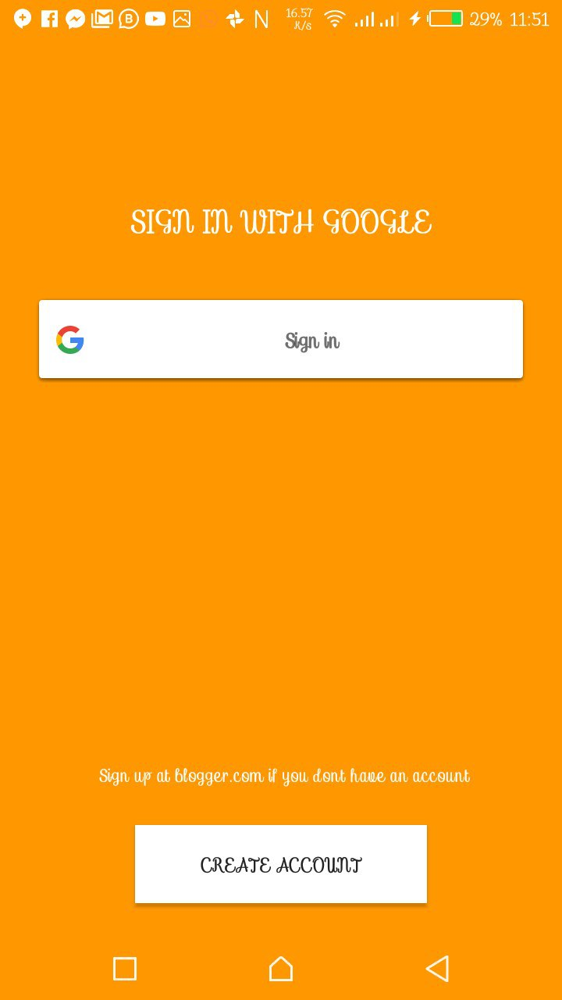
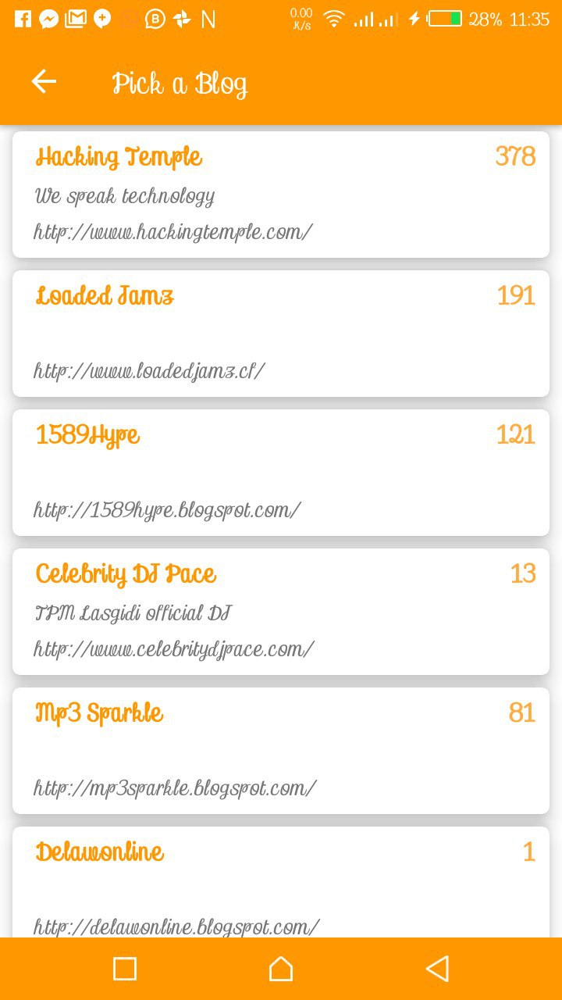
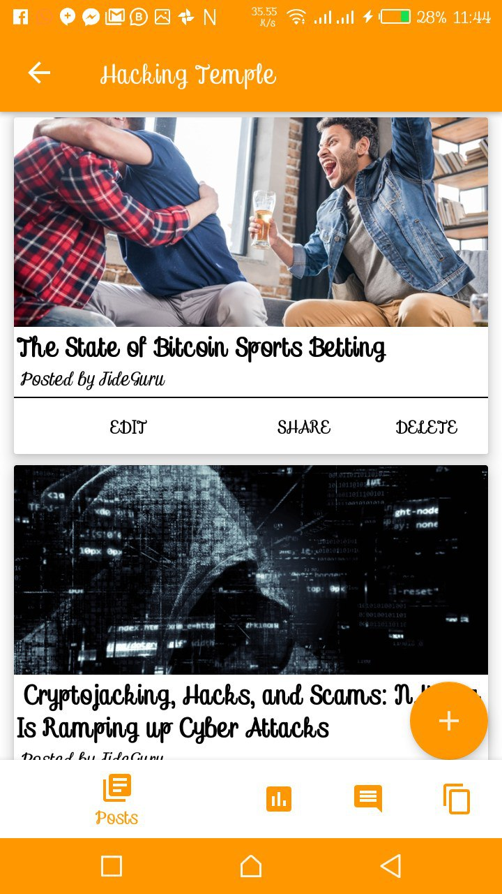
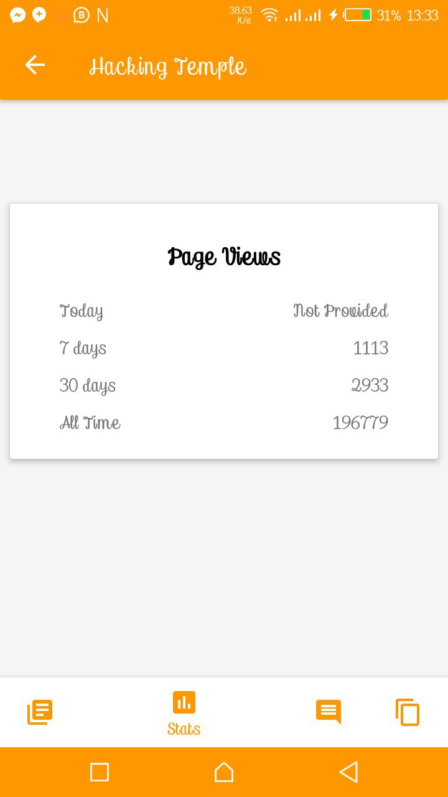

## Quick Blogger 

A mobile app that allows you to manage your Google's blogger dashboard from your phone.

# ScreenShots
  
  

# Status
Under development.
You can also contribute.

# Requirements
* Any Operating System (ie. MacOS X, Linux, Windows)
* Any IDE with Android SDK installed (ie. IntelliJ, Android Studio, VSCode etc)
* A little knowledge of Java
* A brain to think 🤓🤓

# Usage

**Very Important**
Make sure to read the [Blogger Documentation](https://developers.google.com/blogger/docs/3.0/) so as to know how to generate [google-services.json](https://developers.google.com/android/guides/google-services-plugin#adding_the_json_file) file and some other things required for this project

1. Fork and clone.
2. import project to your IDE.
3. Sync Gradle.
4. Start editing.

# TO DOs

- [x] Google Sign-In
- [x] Get and validate access token
- [x] Blogs Lists
- [x] Posts Lists
- [x] Blog's Stats
- [x] All Blog Posts Comments
- [x] Blog's pages
- [ ] Add and Edit Blog Posts
- [ ] Add Pages
- [ ] Improve app's UI

# Author(s)
**Olusegun Festus Babajide**

# Contributors
**404 Not Found.**
Contributions are welcome

# Disclaimer
This code is only intended for learning purposes, i am not responsible for anything you use it for.

Pardon my Bad English 😔

Give a **Star** if you like what you see.
